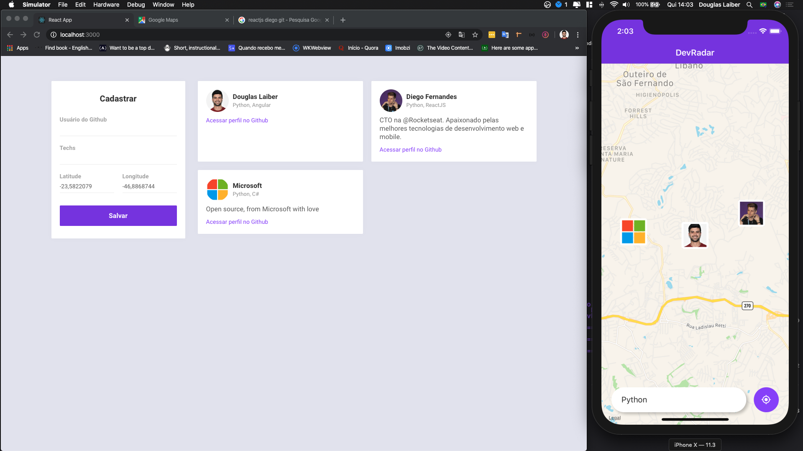

<h1 align="center">
  Semana Omnistack 10: DevRadar
</h1>

## :rocket: Sobre o projeto

O projeto foi desenvolvido com o objetivo de encontrar outros desenvolvedores através da geolocalização e tecnologias conhecidas.

O desafio inclui:

- Permitir cadastrar desenvolvedores através do login do Github, incluindo as tecnologias que conhecem e sua geolocalização.

- Apartir de um dispositivo mobile permitir realizar pesquisas e filtar os desenvolvedores por tecnologia e poder encontrá-los próximo a localização atual (Um raio de 10km)

- O Backend fica responsável por armazenar essas informações em uma base de dados do MongoDB, o Express para a criação de rotas, Websocket para trazer os usuários cadastrados em tempo real.

## Tecnologias usadas:

### NodeJS:

- `ExpressJS`: Utilizado para a criação das rotas da aplicação;

- `MongoDB`: Base de dados da aplicação;

- `Axios`: Utilizado para acessar a API do GitHub;

- `Mongoose`: Para modelar as informações da nossa aplicação para o MongoDB;

- `CORS`: Para permitir que alguns recursos restritos da aplicação sejam utilizados na versão web;

### ReactJS:

- `Axios`: Utilizado para acessar a API do nosso projeto;

- `react, react-dom, react-scripts`: Para podermos acessar os elementos HTML, a árvore de elementos e alguns scripts para a nossa aplicação no ReactJS.

### React Native:

- Além das tradicionais bibliotecas, como react, react-dom, foi utilizado as bibliotecas React-Native-Maps para acessar o mapa através da aplicação, Navigation para acessarmos as outras rotas criadas na aplicação, entre outras ferramentas.